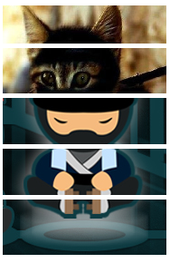

# Ninja To Cat

Create a jQuery puzzle using two images sliced into five parts. Using jQuery, make it so that when each image slice is clicked, it will change to a different picture.

ninja_to_cat.bmp is a picture guide for this assignment.

